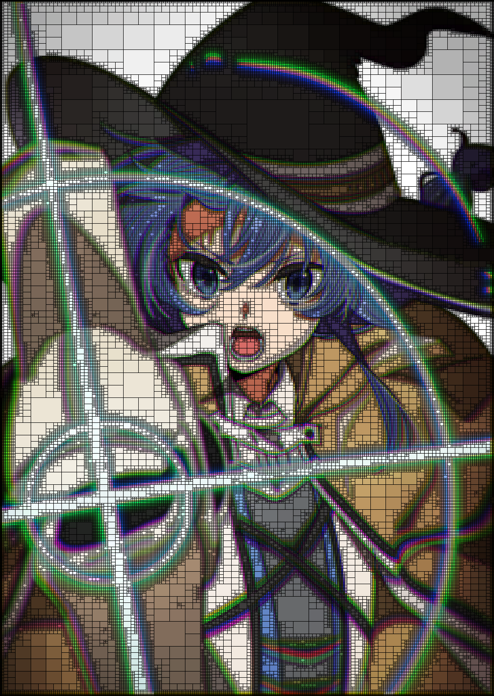

<h2 align="left" style="font-family: SimSun">天河一挂淘龙鱼</h2>

###

###

  

   <!--  -->

  

###

 

## 🏆 GitHub Trophies

---

###

##

  
  
  
  
  
  
  
  
  
  
  
  
  
  
  
  
  
  
  
  
  
  
  
  
  
  
  
  
  
  
  
  
  

###
